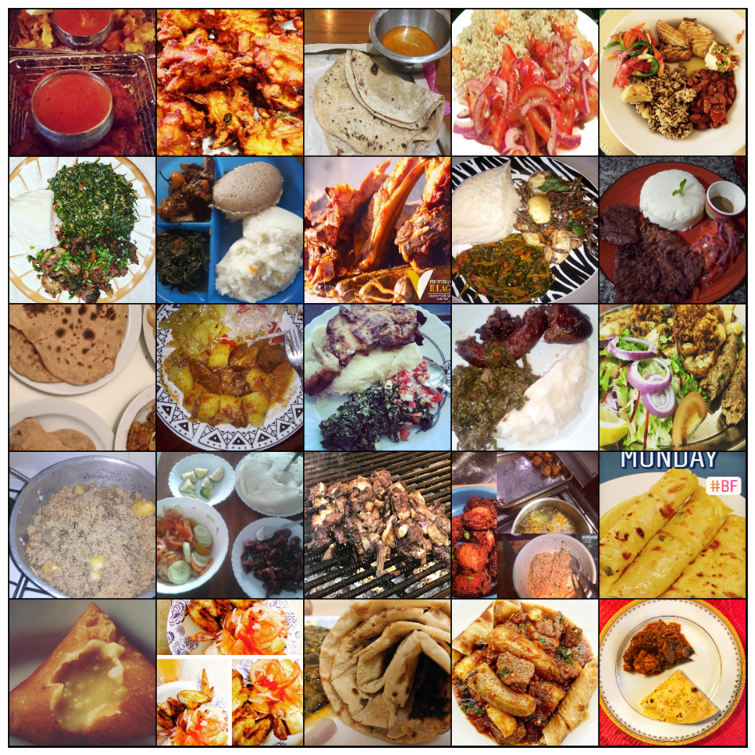

# Kenyan Food Classification (13 Classes)

Image classification of 13 traditional Kenyan food categories using transfer learning with ResNet-50, built with PyTorch Lightning.


---

## Dataset

**8,174 images** across **13 classes**, split into 6,536 training and 1,638 test images. The training set is further divided into train/val using a 75/25 stratified split.

> Bhaji, Chapati, Githeri, Kachumbari, Kukuchoma, Mandazi, Masalachips, Matoke, Mukimo, Nyamachoma, Pilau, Sukumawiki, Ugali

<p align="center">
  
</p>
<p align="center"><em>Sample images from the Kenyan food</em></p>

The dataset expects the following structure under `root_folder` (configured in `config.yaml`):

```
root_folder/
├── train.csv          # columns: id, class
├── test.csv           # column: id
└── images/images/     # all image files
```

## Method

Fine-tuning a pretrained **ResNet-50** backbone with a linear classification head.

**Augmentations** (training only, via Albumentations):
- Color jitter (brightness, contrast, saturation, hue)
- Random grayscale conversion
- Horizontal and vertical flips
- Random 90° rotation and affine shifts
- Elastic transform and grid distortion

**Training setup:**
- Loss: Cross-Entropy
- Optimizer: Adam (configurable via `config.yaml`)
- Scheduler: CosineAnnealingLR (configurable via `config.yaml`)
- Mixed precision: `16-mixed`
- Early stopping on `valid/loss` (patience: 10)
- Best checkpoint saved by `valid/f1_macro`
- Logs: TensorBoard

## Results

| Metric | Value |
|--------|-------|
| Validation Accuracy | **75.2%** |
| Training Epochs | ~200 |
| Dataset Size | 8,174 images |
| Classes | 13 |
| Backbone | ResNet-50 (ImageNet pretrained) |

<p align="center">
  
</p>

Training was monitored with TensorBoard. Early stopping (patience=10) on `valid/loss` prevented overfitting; the best checkpoint was selected by peak `valid/acc`.

## Project Structure

```
├── main.py          # Entry point — wires LightningCLI
├── model.py         # ImageClassifier (LightningModule)
├── datamodule.py    # KenyaDataModule (LightningDataModule)
├── dataset.py       # KenyanFood13Dataset (torch Dataset)
└── config.yaml      # All hyperparameters
```

## Installation

```bash
pip install -r requirements.txt
```

## Usage

### Data Preparation (optional)

Pre-resize images to a fixed square size before training to avoid repeated on-the-fly resizing:

```bash
python resize_images.py \
  --images_dir /path/to/images/images \
  --output_dir /path/to/resized/images/images \
  --size 256
```

| Argument | Default | Description |
|---|---|---|
| `--images_dir` | *(required)* | Source directory containing images |
| `--output_dir` | same as `--images_dir` | Destination directory; omit to resize in-place |
| `--size` | `256` | Target width and height in pixels |
| `--quality` | `95` | JPEG output quality (1–100) |
| `--workers` | CPU count | Parallel worker processes |

### Training

Set `data.root_folder` in `config.yaml` to your local dataset path, then run:

```bash
# Train
python main.py fit --config config.yaml

# Validate a checkpoint on the validation set
python main.py validate --config config.yaml --ckpt_path path/to/checkpoint.ckpt

# Evaluate on the test set
python main.py test --config config.yaml --ckpt_path path/to/checkpoint.ckpt
```

Any `config.yaml` value can be overridden from the command line:

```bash
python main.py fit --config config.yaml --model.optimizer.init_args.lr 0.001 --trainer.max_epochs 50
```

Run `python main.py fit --print_config` to see all available options.

## Hyperparameter Search

Automated search over learning rate, weight decay, batch size, and backbone architecture using [Optuna](https://optuna.org/) with early pruning of unpromising trials.

```bash
pip install optuna optuna-integration[pytorch_lightning]

python hparam_search.py                          # defaults from config.yaml
python hparam_search.py --n-trials 30 --max-epochs 10
```

The search space is defined in `config.yaml` under `hparam_search.search_space`. Each parameter needs a `type` (`float`, `int`, or `categorical`) and the corresponding bounds or choices:

```yaml
hparam_search:
  n_trials: 20
  max_epochs: 5
  search_space:
    lr:
      type: float
      low: 1.0e-6
      high: 1.0e-2
      log: true
    batch_size:
      type: categorical
      choices: [64, 128, 256]
    model_name:
      type: categorical
      choices: [resnet18, efficientnet_b0, convnext_tiny]
```

Each trial is logged to TensorBoard under `logs/optuna/trial_N/`. The study uses `MedianPruner` to stop unpromising trials after a warmup period, optimizing `valid/f1_macro`.

## Visualizing Training

```bash
tensorboard --logdir logs/
```

---

## Cloud Training: Dataset Download, Training, and Artifact Upload

**Prerequisites:** create two S3 buckets (one for datasets, one for artifacts), create an IAM user with appropriate S3 permissions, and generate access keys.

In the platform instance settings, add these variables to the secrets/environment panel before launching:

```bash
AWS_ACCESS_KEY_ID=<YOUR_ACCESS_KEY_ID>
AWS_SECRET_ACCESS_KEY=<YOUR_SECRET_ACCESS_KEY>
AWS_DEFAULT_REGION=<YOUR_REGION>
ARTIFACTS_BUCKET=<BUCKET_NAME>
DATASETS_BUCKET=<ANOTHER_BUCKET_NAME>
```

Both the AWS CLI and boto3 recognize these variable names natively. `DATASETS_BUCKET` is used to download the dataset; `ARTIFACTS_BUCKET` is used to upload trained checkpoints and logs after training.

Install AWS CLI:
```bash
pip install awscli
```

Download dataset:
```bash
aws s3 cp s3://$DATASETS_BUCKET/opencv-pytorch-classification-project-2.zip opencv-pytorch-classification-project-2.zip
```

Unzip downloaded dataset:
```bash
unzip opencv-pytorch-classification-project-2.zip -d /workspace/opencv-pytorch-classification-project-2
```

Download repo:
```bash
git clone https://github.com/ManuelZ/food-classification.git
```

Install dependencies:
```bash
cd food-classification
pip install -r requirements.txt
```

Run:
```bash
python main.py fit --config config.yaml --trainer.max_epochs=10 --data.num_workers=16
```

Monitor training with TensorBoard (run on the remote instance):
```bash
tensorboard --logdir food_classification/logs/
```

Forward the TensorBoard port to your local machine (run locally):
```bash
ssh -p <remote_port> root@<remote_host> -L 16006:localhost:6006 -i ~/.ssh/id_ed25519_platform
```

Then open http://localhost:16006 in your local browser.

Upload artifacts:
```bash
aws s3 cp logs/ s3://$ARTIFACTS_BUCKET/food_classification/ --recursive
```

---

**Note:** This project was originally developed as the second assignment of the OpenCV University course ["Deep Learning with PyTorch"](https://opencv.org/university/deep-learning-with-pytorch/).
