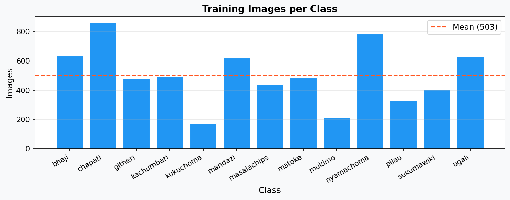
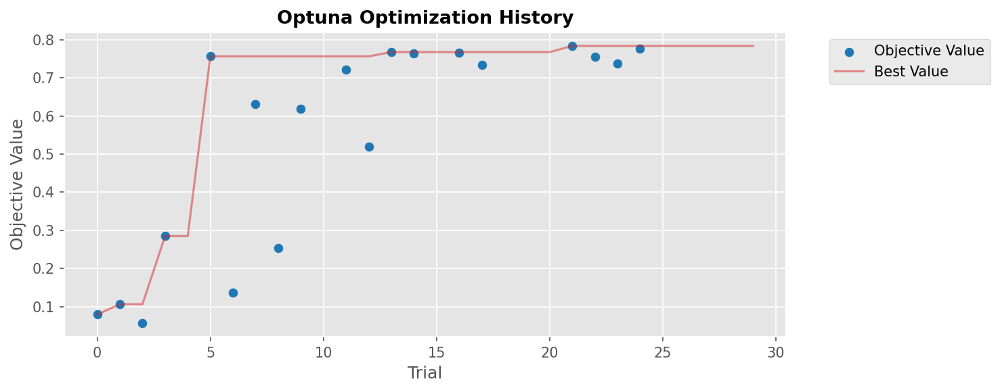
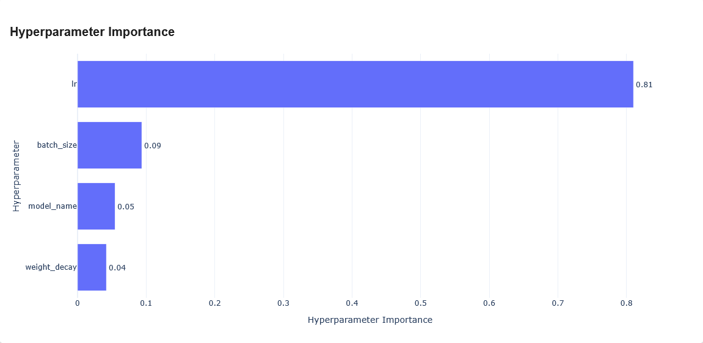

# Kenyan Food Classification (13 Classes)

Benchmarking pretrained CNN backbones for image classification of 13 traditional Kenyan food categories, using Optuna hyperparameter search and PyTorch Lightning.

> See [SETUP.md](SETUP.md) for installation, training, and cloud training instructions.

---

## Introduction

This project benchmarks 12 pretrained CNN backbones on a Kenyan food dataset to identify the best architecture and hyperparameter configuration. The task is non-trivial: training counts range from 173 (Kukuchoma) to 862 (Chapati), several categories are visually similar (Nyamachoma and Kukuchoma are both grilled meats), and web-sourced images exhibit high intra-class variation in plating, lighting, and background.

## Dataset

**8,174 images** across **13 classes**, split into 6,536 training and 1,638 test images. The training set is further divided into train/val using a 75/25 stratified split. Dataset provided by the [OpenCV University "Deep Learning with PyTorch" course](https://opencv.org/university/deep-learning-with-pytorch/).

> Bhaji, Chapati, Githeri, Kachumbari, Kukuchoma, Mandazi, Masalachips, Matoke, Mukimo, Nyamachoma, Pilau, Sukumawiki, Ugali

  

<em>Sample images from the Kenyan food dataset — 5 random images per class</em>

  

<em>Training image counts per class</em>

**Preprocessing:** Images are pre-resized to **256×256 pixels** (INTER_AREA, JPEG quality 95) before training. No further resize or crop is applied at runtime.

**Train / validation split:** `StratifiedShuffleSplit` with `random_state=0`. The 25% validation fraction provides a stable optimization signal for Optuna's pruner across trials limited to 10 epochs each.

## Method

**Fine-tuning strategy:** Full fine-tuning — backbone weights are *not* frozen. The pretrained backbone's final classification layer is replaced with a randomly-initialized linear head (13 classes), and all parameters are jointly optimized from the start.

**Backbone candidates:**

| Model | Params (M) | ImageNet Top-1 (%) |
|---|---|---|
| shufflenet_v2_x1_0 | 2.3 | 60.6 |
| mobilenet_v3_small | 2.5 | 67.7 |
| regnet_y_400mf | 4.3 | 75.8 |
| efficientnet_b0 | 5.3 | 77.7 |
| mobilenet_v3_large | 5.5 | 75.3 |
| mnasnet1_3 | 6.3 | 76.5 |
| regnet_y_800mf | 6.4 | 78.8 |
| resnet18 | 11.7 | 69.8 |
| resnet34 | 21.8 | 73.3 |
| resnet50 | 25.6 | 80.9 |
| convnext_tiny | 28.6 | 82.5 |
| convnext_small | 50.2 | 83.6 |

All models use `weights="DEFAULT"` (best available torchvision weights). ImageNet Top-1 values sourced from [torchvision model documentation](https://pytorch.org/vision/stable/models.html).

**Input normalization:** ImageNet statistics applied to all splits — mean `[0.485, 0.456, 0.406]`, std `[0.229, 0.224, 0.225]`.

**Augmentations** (training only):

| Transform | Parameters | Probability |
|---|---|---|
| Horizontal flip | — | 0.5 |
| Random 90° rotation | — | 0.5 |
| Color jitter | brightness ±0.4, contrast ±0.4, saturation ±0.4, hue ±0.2 | 0.8 |
| Grayscale | — | 0.1 |
| Gaussian blur | kernel 3–7 | 0.2 |
| Gaussian noise | — | 0.2 |
| Sharpening | α: 0.2–0.5, lightness: 0.5–1.0 | 0.3 |
| Affine transform | translate ±10%, rotate ±45° | 0.5 |
| Coarse dropout | 1–8 holes, 16–32 px | 0.3 |

**Training setup:**
- Loss: Cross-Entropy
- Optimizer: Adam
- Scheduler: CosineAnnealingLR
- Mixed precision: `16-mixed`
- Early stopping on `valid/loss` (patience: 10)
- Best checkpoint saved by `valid/f1_macro`
- Global seed: `seed_everything: 21`
- Logs: TensorBoard

## Tech Stack

| Component | Library |
|---|---|
| Training framework | PyTorch Lightning |
| Models | torchvision |
| Augmentations | Albumentations |
| Hyperparameter search | Optuna |
| Experiment tracking | TensorBoard |
| Metrics | torchmetrics |
| Image loading | OpenCV |
| Data splitting | scikit-learn |

---

## Phase 1 — Architecture Search (Optuna)

Hyperparameter search using [Optuna](https://optuna.org/) over 30 trials, 10 epochs each. Unpromising trials are pruned with `MedianPruner` (3 startup trials, 5 warmup steps), optimizing `valid/f1_macro`.

**Search space:**

| Hyperparameter | Type | Range / Choices |
|---|---|---|
| `lr` | log-uniform float | 1e-6 – 1e-2 |
| `weight_decay` | log-uniform float | 1e-6 – 1e-2 |
| `batch_size` | categorical | 64, 128, 256, 384 |
| `model_name` | categorical | all 12 backbone candidates |

With 12 backbone candidates and 30 trials, each backbone receives ~2–3 trials on average. Optuna's TPE sampler concentrates later trials on promising configurations, so weaker backbones are intentionally under-explored.

**All 30 Optuna trials** (sorted by val F1; † = pruned by MedianPruner):

| Trial | Backbone | LR | Weight Decay | Batch Size | Val F1 (macro) |
|---|---|---|---|---|---|
| 21 | convnext_tiny | 2.01e-04 | 1.06e-06 | 128 | **0.7835** |
| 24 | convnext_tiny | 2.80e-04 | 1.00e-06 | 128 | 0.7760 |
| 13 | convnext_tiny | 4.29e-04 | 2.17e-03 | 128 | 0.7674 |
| 16 | convnext_tiny | 1.32e-04 | 1.47e-06 | 128 | 0.7664 |
| 14 | convnext_tiny | 5.06e-04 | 1.35e-06 | 128 | 0.7645 |
| 5  | efficientnet_b0 | 5.84e-04 | 2.08e-03 | 128 | 0.7561 |
| 22 | convnext_tiny | 1.54e-04 | 2.62e-06 | 128 | 0.7552 |
| 23 | convnext_tiny | 7.33e-05 | 1.37e-05 | 128 | 0.7380 |
| 17 | convnext_tiny | 1.40e-04 | 5.54e-06 | 256 | 0.7342 |
| 11 | convnext_small | 4.06e-04 | 3.49e-03 | 128 | 0.7216 |
| 7  | regnet_y_800mf | 6.18e-05 | 2.18e-04 | 128 | 0.6320 |
| 9  | resnet18 | 3.22e-05 | 5.19e-04 | 64 | 0.6189 |
| 26† | mobilenet_v3_large | 3.13e-04 | 2.71e-06 | 256 | 0.5663 |
| 29† | resnet34 | 5.16e-05 | 2.44e-05 | 256 | 0.5462 |
| 12 | convnext_small | 5.25e-04 | 5.68e-03 | 128 | 0.5201 |
| 20† | resnet50 | 1.50e-03 | 5.71e-06 | 128 | 0.4719 |
| 25† | convnext_tiny | 1.19e-03 | 1.14e-04 | 128 | 0.4599 |
| 18† | mobilenet_v3_large | 1.56e-04 | 5.29e-06 | 384 | 0.3382 |
| 3  | efficientnet_b0 | 1.17e-05 | 6.18e-05 | 128 | 0.2852 |
| 19† | resnet34 | 1.69e-03 | 1.33e-03 | 128 | 0.2552 |
| 8  | mnasnet1_3 | 3.16e-05 | 4.13e-05 | 384 | 0.2539 |
| 28† | shufflenet_v2_x1_0 | 9.20e-04 | 9.73e-04 | 384 | 0.2063 |
| 6  | mobilenet_v3_small | 5.53e-06 | 2.23e-04 | 64 | 0.1370 |
| 1  | regnet_y_800mf | 1.44e-06 | 4.38e-04 | 64 | 0.1067 |
| 0  | regnet_y_400mf | 4.14e-06 | 3.41e-05 | 256 | 0.0796 |
| 4† | shufflenet_v2_x1_0 | 1.28e-05 | 1.80e-05 | 256 | 0.0590 |
| 2  | mnasnet1_3 | 3.11e-06 | 3.27e-04 | 384 | 0.0579 |
| 27† | resnet18 | 9.33e-03 | 1.15e-05 | 64 | 0.0551 |
| 10† | efficientnet_b0 | 4.30e-03 | 9.68e-03 | 128 | 0.0525 |
| 15† | convnext_tiny | 3.18e-03 | 1.20e-06 | 128 | 0.0165 |

  

<em>Optuna optimization history — val F1 macro per trial</em>

  

<em>Hyperparameter importance (Optuna FAnova)</em>

### Model Selection

`convnext_tiny` claimed 8 of the top 10 spots and reached **0.7835 val F1** in just 10 epochs, but at 28.6M parameters it is the heaviest candidate in the search. `efficientnet_b0` reached **0.7561** with only 5.3M parameters — a 5× reduction in model size for a ~3.5 point F1 gap. Given the deployment cost of a model 5× larger for a marginal accuracy gain, `efficientnet_b0` was selected for full training.

---

## Phase 2 — Full Training

`efficientnet_b0` is trained to convergence using hyperparameters from a dedicated Optuna search (model fixed to `efficientnet_b0`), with early stopping (patience 10) on `valid/loss`.

### efficientnet_b0

*(Results pending)*

| Metric | Value |
|---|---|
| Learning rate | 5.84e-04 |
| Weight decay | 2.08e-03 |
| Batch size | 128 |
| Epochs trained | — |
| Val F1 (macro) | — |
| Val Accuracy | — |

---

## Discussion

*(To be completed once results are available.)*

Key questions to address:
- Does backbone size (params or ImageNet Top-1) predict performance on this domain?
- Which classes are most confused, and does visual similarity (e.g., Nyamachoma vs. Kukuchoma) explain the errors?
- Which hyperparameter dominates according to Optuna's importance analysis?

## Limitations

- **Class imbalance:** training counts range from 173 (Kukuchoma) to 862 (Chapati) — a 5× spread — making per-class performance highly variable and macro F1 a more informative metric than accuracy.
- **Short Optuna trials:** 10 epochs per trial may underestimate large backbones (e.g., convnext_small at 50M params) that converge more slowly.
- **No vision transformers:** ViT, Swin, and other attention-based architectures are not evaluated.

---

*Originally developed as the second assignment of the [OpenCV University "Deep Learning with PyTorch" course](https://opencv.org/university/deep-learning-with-pytorch/).*
